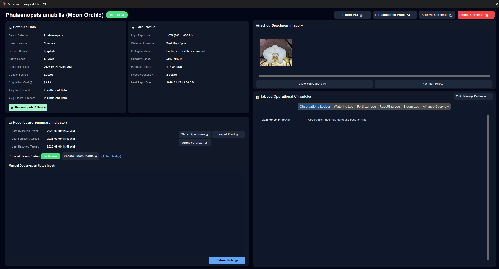

# Interface Layout

This section details the core operational cards, tabbed ledgers, and telemetry displays within Orchid Tracker.

## Specimen Passport Modal

The Specimen Passport Modal provides a centralized view for individual plant management, combining botanical metadata, care parameters, and historical logging.

<figcaption style="font-size: 0.85rem; color: #b8a894; font-style: italic; margin-top: 6px; margin-bottom: 24px;">
  Specimen Passport Modal displaying botanical records, care parameters, recent hydration indicators, attached imagery, and tabbed operational logs. (Click image to expand)
</figcaption>

### Core Panel Architecture

* **Botanical Info & Care Profile:** Tracks taxonomic data, origin, acquisition cost, light exposure requirements, and potting substrate configurations.
* **Recent Care Summary Indicators:** Offers quick-action buttons for recording hydration events, fertilizer applications, repotting targets, and manual observation notes.
* **Specimen Imagery:** Displays attached photo galleries with direct attachment and full-screen preview controls.
* **Tabbed Operational Chronicles:** Integrates tabbed historical logs for observations, watering history, fertilizer tracking, repotting milestones, and bloom logs.
